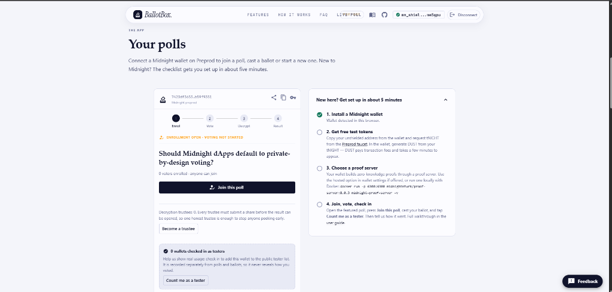
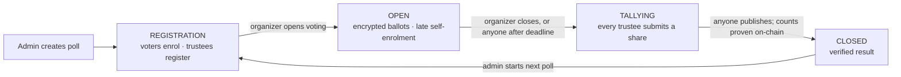
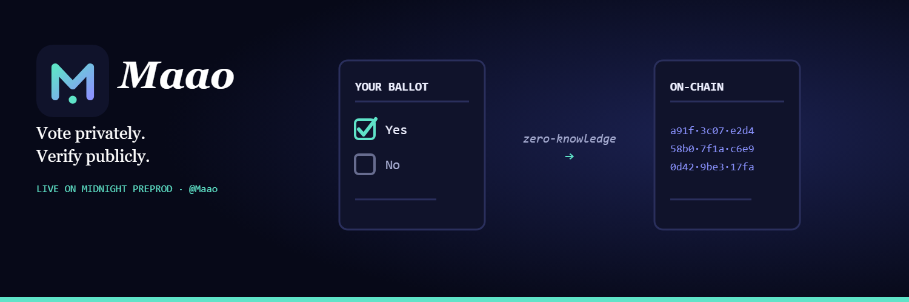

<p align="center">
  
</p>

<h1 align="center">Maao</h1>

<p align="center"><b>Private, verifiable polls on Midnight.</b> Vote privately. Verify publicly.</p>

<p align="center">
  <a href="https://github.com/mesayanroy/Maao/actions/workflows/ci.yaml"></a>
  <a href="https://github.com/mesayanroy/Maao/actions/workflows/deploy.yaml"></a>
  <a href="#contract--deployment"></a>
  <a href="#level-6--supermoon"></a>
  <a href="./LICENSE"></a>
</p>

**Maao** runs anonymous polls on the Midnight blockchain. Your ballot is encrypted before it
leaves your browser, a zero-knowledge proof shows you are allowed to vote without revealing
which voter you are, and the final result is checked on-chain against the encrypted ballots,
so nobody has to trust the organizer.

## At a glance

| | |
|---|---|
| 🌐 **Live app** | **<https://ballotbox-beige.vercel.app/>** |
| 📜 **Preprod contract** | `7423df36535c53ec590fd268f36771b9b9bd63ab741706062ac820f7b59f9351` ([deployment record](./deployments/preprod.json)) |
| 📊 **Tester sheet** | **[Maao tester sheet](https://docs.google.com/spreadsheets/d/1ygm5Zu_e05EzTtL7cVz3G_rr9JaG2aon-g9OzCLBCoE/edit?resourcekey=&gid=1539670642#gid=1539670642)** · 71 testers, oldest first ([CSV](./docs/tester-sheet.csv)) |
| 💬 **Give feedback** | [Feedback form](https://forms.gle/d7TDeV5dcVFrKr8y9) · [how feedback is used](./docs/FEEDBACK.md) |
| 🙋 **Level 6** | **71 / 70** Midnight Preprod testers, average **8.9 / 10** · [USERS.md](./USERS.md) · [submission](./docs/SUBMISSION.md) |
| 𝕏 **Product profile** | **[`@Maao`](https://x.com/SayanRo27946715)** |
| 🎬 **Demo video** | [Watch the walkthrough](https://drive.google.com/drive/folders/17Wp-457jbYBe5BfflG4Z4f4I7z0sTcat?usp=sharing) |
| 💻 **Source** | [github.com/mesayanroy/Maao](https://github.com/mesayanroy/Maao) |
| 📖 **Docs** | [User guide](./docs/USER_GUIDE.md) · [Architecture](./docs/ARCHITECTURE.md) · [Privacy model](./PRIVACY.md) · [Deployment](./docs/DEPLOYMENT.md) · [Integration](./api/INTEGRATION.md) |

<p align="center">
  <a href="https://ballotbox-beige.vercel.app"></a>
</p>

## Try it in five minutes

| Step | What to do | Where |
|:---:|---|---|
| 1 | Install a Midnight wallet and switch it to **Preprod** | [Lace (Midnight)](https://chromewebstore.google.com/detail/lace-midnight-preview/hgeekaiplokcnmakghbdfbgnlfheichg) or [1AM](https://chromewebstore.google.com/detail/1am/bphnkdkcnfhompoegfpgnkidcjfbojjp) |
| 2 | Get free tNIGHT, then generate DUST in the wallet to pay fees | [Preprod faucet](https://faucet.preprod.midnight.network/) |
| 3 | Pick a proof server: the wallet's hosted option, or `npm run proof-server` | Wallet settings |
| 4 | Open the live app, press **Join this poll**, vote, then **Count me as a tester** | [Live app](https://ballotbox-beige.vercel.app/) |
| 5 | Tell us how it went | [Feedback form](https://forms.gle/d7TDeV5dcVFrKr8y9) |

The [user guide](./docs/USER_GUIDE.md) walks through every step with screenshots.

---

## Contents

| Section | What's inside |
|---|---|
| [What Maao does](#what-maao-does) | The problem with online voting, and how Maao avoids it |
| [Features](#features) | What each feature means for voters and organizers |
| [How a poll works](#how-a-poll-works) | Lifecycle diagram, steps, and which circuit runs at each stage |
| [Contract & deployment](#contract--deployment) | Address, network, source, and how to verify without a wallet |
| [Privacy model](#privacy-model) | What is private, what is public, what is proved, and known limits |
| [Setup & run locally](#setup--run-locally) | Prerequisites, install, environment variables, npm scripts |
| [Usage](#usage) | Step-by-step for voters, organizers, trustees, and the CLI |
| [Tech stack](#tech-stack) · [Tests](#tests) · [CI/CD](#cicd) | What it is built with and how it is checked |
| [Project structure](#project-structure) · [Performance](#performance) | Repo layout and proving cost per circuit |
| [Roadmap](#roadmap) · [Troubleshooting](#troubleshooting) | What's next, and fixes for common problems |
| [Documentation](#documentation) · [Feedback & iterations](#feedback--iterations) | Every doc in the repo, and what testers changed |
| [Level 6 — Supermoon](#level-6--supermoon) | Tester numbers, ratings and evidence |
| [Product X profile & brand](#product-x-profile--brand) · [Contributing](#contributing-security-license) | Social, logo, banner, and how to contribute |

---

## What Maao does

| | Trust a server | Vote on a public chain | **Maao on Midnight** |
|---|---|---|---|
| Can the operator see your vote? | ✅ Yes | — | ❌ **No.** Ballots are encrypted in your browser |
| Can anyone see how you voted? | — | ✅ Yes, forever | ❌ **No.** Only the total is ever decrypted |
| Can the count be changed? | ✅ Yes, by the operator | ❌ No | ❌ **No.** The tally is proven on-chain |
| Can anyone check the result? | ❌ No | ✅ Yes | ✅ **Yes**, from public data, with no wallet |

| Good fit for | Why |
|---|---|
| DAO signalling | Members vote honestly without public pressure on their wallet |
| Community temperature checks | Quick open polls anyone can join with one click |
| Team retros and student councils | Invite-only rolls, secret ballots, verifiable counts |

## Features

| | Feature | What it means for you |
|:---:|---|---|
| 🔒 | **Secret ballots** | Your choice is encrypted (exponential ElGamal) and is never a public transaction input. Nobody can read an individual ballot, including the organizer. |
| 🕵️ | **Anonymous eligibility** | You prove membership of the voter roll in zero knowledge. The chain learns that *a* member voted, not which one. |
| ☝️ | **One counted ballot per voter** | Poll-bound nullifiers stop double voting without identifying anyone. |
| 🔁 | **Change your vote** | Re-voting replaces your earlier ballot, so a receipt you were pressured to show proves nothing. |
| 🗝️ | **No single party can decrypt** | Threshold (n-of-n) trustees: every trustee must contribute a share before the result opens. |
| ✅ | **Verified results** | `publishTally` re-encrypts the claimed counts and checks them on-chain. Anyone can publish once the shares are in, and anyone can re-verify. |
| 🚪 | **Open or invite-only polls** | Public polls let people enrol themselves with one click. Binding votes use an organizer-managed roll. |
| ⏰ | **On-chain deadline & quorum** | Voting closes automatically. A poll that misses quorum is flagged as non-binding. |
| 👀 | **Preview without a wallet** | Invite links show the question, stage and turnout before you install anything. |
| 💾 | **Key backup & restore** | Your poll key survives reloads and can be exported, or imported from the CLI. |
| 🙋 | **Verifiable tester check-in** | An opt-in, on-chain participant list, kept separate from ballots. |
| 🧰 | **In-app toolkit** | Step-by-step cards for organizers, trustees, key safety and verification, right under the live app. |

## How a poll works



| # | Step | Who | Circuit | What the contract checks |
|:---:|---|---|---|---|
| 1 | **Create** | Contract admin (the deploying wallet) | `createPoll` | No poll is in progress; caller is the admin. Sets the question, optional deadline, quorum and **open enrollment** |
| 2 | **Enrol** | Voters (open polls) or organizer (invite-only) | `selfEnroll` · `enrollVoter` | Commitment not already enrolled. A commitment is a one-way hash of a key that never leaves the voter's device |
| 3 | **Register trustees** | One or more wallets | `registerTrustee` | Still in registration; not already a trustee. Keys sum to the tally key, and nobody holds the matching secret |
| 4 | **Open voting** | Poll creator | `openVoting` | At least one trustee is registered |
| 5 | **Vote** | Enrolled voters | `castVote` | Roll membership (Merkle path), unspent nullifier, choice is Yes / No / Abstain. Adds the encrypted ballot to the running total |
| 6 | **Close** | Creator any time, anyone after the deadline | `closeVoting` | Poll is open; caller is the creator or the deadline has passed |
| 7 | **Decrypt** | Every trustee | `submitDecryptionShare` | Share matches the trustee's registered key; no duplicate shares |
| 8 | **Publish** | Anyone | `publishTally` | Every trustee has contributed; the re-encrypted counts match the ballots exactly |

| Stage | Who acts | Allowed actions |
|---|---|---|
| `REGISTRATION` | Organizer · voters · trustees | `enrollVoter` · `selfEnroll` · `registerTrustee` · `openVoting` |
| `OPEN` | Enrolled voters | `castVote` (a re-vote replaces the earlier ballot) · late `selfEnroll` · `closeVoting` |
| `TALLYING` | Every trustee, then anyone | `submitDecryptionShare` · `publishTally` |
| `CLOSED` | Everyone | Read the verified result · admin may `createPoll` again |

## Contract & deployment

| Item | Value |
|---|---|
| Network | Midnight **Preprod** |
| Contract address | `7423df36535c53ec590fd268f36771b9b9bd63ab741706062ac820f7b59f9351` |
| Deploy transaction and block | [`deployments/preprod.json`](./deployments/preprod.json) |
| Web app | <https://ballotbox-beige.vercel.app/> (the featured poll runs on this contract) |
| Contract source | [`contract/src/private-polling.compact`](./contract/src/private-polling.compact) (Compact 0.23, compiler 0.31.0) |
| Tester list | [USERS.md](./USERS.md) · [tester sheet](https://docs.google.com/spreadsheets/d/1ygm5Zu_e05EzTtL7cVz3G_rr9JaG2aon-g9OzCLBCoE/edit?resourcekey=&gid=1539670642#gid=1539670642): 71 / 70 Preprod testers |
| Check-in export | [`deployments/participants-preprod.json`](./deployments/participants-preprod.json) |

Anyone can check the deployment and the result independently, with no wallet:

| Command | What it does |
|---|---|
| `npm run verify -- <contract-address>` | Re-derives the tally from public chain data and checks the published result |
| `npm run export-participants -- <contract-address>` | Lists the wallets that checked in as testers |

## Privacy model

| Data | Visibility | How |
|---|---|---|
| Your vote choice | 🔒 **Private** | Encrypted in your browser, never a public input |
| Which enrolled voter cast a ballot | 🔒 **Private** | Zero-knowledge Merkle membership proof |
| Your secret key | 🔒 **Private** | Stays in your browser (back it up with 🔑) |
| Poll question, stage, deadline, quorum | 🌐 Public | Contract ledger |
| Roll of anonymous voter commitments | 🌐 Public | One-way hashes; they don't reveal who you are |
| Encrypted running tally | 🌐 Public | Ciphertext only |
| Turnout (ballots cast, voters enrolled) | 🌐 Public | Contract counters |
| One nullifier per ballot | 🌐 Public | Unlinkable to the voter and across polls |
| Final counts | 🌐 Public | Only after every trustee has contributed |
| Checked-in tester wallets | 🌐 Public | **Opt-in**, and unlinked to ballots |

| Proved without revealing | What stays hidden |
|---|---|
| You are on the voter roll | Which voter you are |
| You have not already voted | Any link between your ballots |
| Your ballot is a valid choice | The choice itself |
| The published counts are exactly the decryption of the ballots | Every single ballot |

| Known limit | Impact | Details |
|---|---|---|
| Re-voting is observable | An observer can see *that* a voter re-voted, not the choice | [`PRIVACY.md`](./PRIVACY.md) |
| Open enrollment is not Sybil-resistant | One person can enrol several keys on open polls; use invite-only for binding votes | [`PRIVACY.md`](./PRIVACY.md) |
| n-of-n trustees | One missing trustee blocks the result | [`PRIVACY.md`](./PRIVACY.md) |

---

## Setup & run locally

### Prerequisites

| Tool | Version | Notes |
|---|---|---|
| Node.js | **22+** (24 recommended, see `.nvmrc`) | Check with `node -v` |
| Docker | Any recent | Runs the proof server and the end-to-end network |
| Compact compiler | **0.31.0** | Native on Linux/macOS; on **Windows it runs inside WSL** automatically |
| Browser wallet | [Lace (Midnight)](https://chromewebstore.google.com/detail/lace-midnight-preview/hgeekaiplokcnmakghbdfbgnlfheichg) or [1AM](https://chromewebstore.google.com/detail/1am/bphnkdkcnfhompoegfpgnkidcjfbojjp) | Set to **Preprod** |

| OS | Install the Compact compiler |
|---|---|
| Linux / macOS | `curl --proto '=https' --tlsv1.2 -LsSf https://github.com/midnightntwrk/compact/releases/latest/download/compact-installer.sh \| sh` then `compact update 0.31.0` |
| Windows | Install WSL with Ubuntu, then `wsl -d Ubuntu -- apt-get install -y unzip`. `npm run compact` installs the compiler inside WSL the first time |

### Install and run

| Step | Command | What it does |
|:---:|---|---|
| 1 | `git clone https://github.com/mesayanroy/Maao.git` | Clone the repository |
| 2 | `cd Maao` | Enter the project folder |
| 3 | `npm ci --legacy-peer-deps` | One install for all four workspaces |
| 4 | `npm run compact` | Compile the contract into `contract/src/managed` (about 1 minute) |
| 5 | `npm run build` | Build contract → api → cli → ui |
| 6 | `npm test` | Run 66 tests across contract, api and ui |
| 7 | `npm run proof-server` | Start `midnightntwrk/proof-server:8.0.3` on `:6300` (or use the wallet's hosted prover) |
| 8 | `npm run dev` | Start the web app on <http://localhost:5173> (Preprod) |
| 9 | `npm run preview` | *(optional)* Serve the production build on <http://localhost:4173> |

Copy-paste version:

```bash
git clone https://github.com/mesayanroy/Maao.git
cd Maao
npm ci --legacy-peer-deps
npm run compact && npm run build && npm test
npm run proof-server   # in a second terminal
npm run dev
```

### Deploy your own contract (optional)

| Step | Command | Result |
|:---:|---|---|
| 1 | `cp private-polling-cli/.env.example private-polling-cli/.env` | Then add a funded Preprod wallet seed |
| 2 | `npm run deploy` | Deploys the contract and writes a public record to `deployments/preprod.json` |
| 3 | 🔑 in the web app | Import the organizer key from `private-polling-cli/.secrets/` (gitignored) to manage the poll from a browser |

Full guide: [docs/DEPLOYMENT.md](./docs/DEPLOYMENT.md).

### Environment variables

| Variable | File | Purpose |
|---|---|---|
| `VITE_NETWORK_ID` | `private-polling-ui/.env.local` | `preprod` or `preview` |
| `VITE_CONTRACT_ADDRESS` | `private-polling-ui/.env.local` | Featured poll on the landing page |
| `VITE_X_URL` · `VITE_GITHUB_URL` · `VITE_FEEDBACK_URL` | `private-polling-ui/.env.local` | Product links; unset links are hidden |
| `VITE_INDEXER_URL` · `VITE_INDEXER_WS_URL` | `private-polling-ui/.env.local` | Indexer for the wallet-free poll preview |
| `MIDNIGHT_WALLET_SEED` | `private-polling-cli/.env` | Hex seed of a funded Preprod wallet. **Never commit it** |
| `PRIVATE_STATE_PASSWORD` | `private-polling-cli/.env` | Encrypts the CLI's local private state |
| `DEMO_POLL_QUESTION` · `DEMO_POLL_DAYS` | `private-polling-cli/.env` | Optional poll to start right after deploying |
| `PROOF_SERVER_URL` · `INDEXER_URL` · `NODE_URL` | `private-polling-cli/.env` | Optional endpoint overrides |

Templates: [`private-polling-ui/.env.example`](./private-polling-ui/.env.example) · [`private-polling-cli/.env.example`](./private-polling-cli/.env.example).

### npm scripts

| Script | What it does |
|---|---|
| `npm run compact` | Compile the Compact contract (uses WSL on Windows) |
| `npm run build` | Build every workspace in dependency order |
| `npm test` | Contract, api and ui unit tests |
| `npm run lint` · `npm run typecheck` | Lint and typecheck every workspace |
| `npm run dev` · `npm run preview` | Run the web app (dev server or production build) |
| `npm run proof-server` | Local proof server in Docker on `:6300` |
| `npm run cli` | Interactive CLI against Preprod |
| `npm run deploy` | Deploy a contract from the terminal |
| `npm run verify -- <addr>` | Re-check a published tally from public data |
| `npm run export-participants -- <addr>` | Export checked-in tester wallets |
| `npm run e2e` | 26-step end-to-end poll on a local Midnight network (Docker) |

---

## Usage

### As a voter

| Step | Action | Notes |
|:---:|---|---|
| 1 | Open an invite link (`…/?poll=<address>`) or the featured poll | Question, stage and turnout show before you connect |
| 2 | **Connect wallet & take part** | Lace or 1AM on Preprod |
| 3 | **Join this poll** | Open polls. For invite-only polls, copy your commitment and send it to the organizer |
| 4 | Choose **Yes / No / Abstain** | Proving takes about 30–120 s. You can change your vote until voting closes |
| 5 | **Count me as a tester** · **Feedback** | Optional, and never linked to your ballot |

### As an organizer

| Step | Action | Notes |
|:---:|---|---|
| 1 | **Deploy a new poll contract** | Your wallet becomes the admin. **Back up your key** (🔑) |
| 2 | **Start poll** | Question, voting window, quorum, open or invite-only |
| 3 | **Become a trustee** and invite others | At least one trustee is required before voting opens |
| 4 | Enrol voters (invite-only), then **Open voting** | Share the invite link (📤) |
| 5 | **Close voting** | Any time; anyone can close once the deadline passes |

### As a trustee

| Step | Action | Notes |
|:---:|---|---|
| 1 | **Become a trustee** during registration | Adds your key to the tally key |
| 2 | **Submit share** after voting closes | Proven against your registered key |
| 3 | Anyone presses **Publish the result** | Once every trustee has submitted |

### From the CLI

| Command | What it covers |
|---|---|
| `npm run cli` | Interactive menu for every circuit: create, enrol, self-enrol, trustee, vote, close, share, publish, check-in |

More: [`private-polling-cli/README.md`](./private-polling-cli/README.md).

---

## Tech stack

| Layer | What it uses |
|---|---|
| Contract | **Compact 0.23**, compiler **0.31.0**, `compact-runtime` 0.16, ledger-v8 |
| Proving | Midnight **proof-server 8.0.3** (Docker), circuit keys shipped with the app |
| Chain access | `midnight-js` 4.1.1: indexer, node RPC, HTTP proof client |
| Web app | React 19, TypeScript, Vite 8, MUI, RxJS |
| Wallet | Midnight DApp connector API (Lace or 1AM) |
| CLI & tests | Node 24, vitest, testcontainers (node 0.22.3, indexer 4.0.1) |
| CI/CD | GitHub Actions → Vercel (prebuilt output) |

## Tests

| Suite | Tests | Covers |
|---|---:|---|
| `contract` | 47 | Lifecycle, admin gating, open/invite-only enrollment, historic roll, nullifiers, ElGamal tally, re-voting, threshold decryption, deadline/quorum, check-in isolation |
| `api` | 5 | End-to-end tally decryption from public ledger data (up to 70 voters) |
| `private-polling-ui` | 14 | Key persistence across reloads, ballots never stored at rest, key backup/restore (including pre-rename backups), input parsing, error mapping |
| **end-to-end** | 26 steps | A full poll with **real proofs and transactions** on a local Midnight network: deploy, open enrollment, late joining, encrypted votes, re-vote, rejections (duplicate enrolment, unenrolled voter, early close, non-admin), check-in, decryption share, permissionless verified publish, second poll |

| Command | Runs |
|---|---|
| `npm test` | contract (47) + api (5) + ui (14) |
| `npm run e2e` | The end-to-end poll (Docker running; about 6 minutes, the first run also pulls images) |
| `npm run verify -- <addr>` | Re-checks a published tally from public chain data alone |

## CI/CD

| Workflow | Runs on | What it does |
|---|---|---|
| **CI** · [`ci.yaml`](./.github/workflows/ci.yaml) | Every push and PR to `main` | Compiles the contract with Compact 0.31.0, then typecheck, lint, build and test for all four packages; checks the web build ships its circuit keys; on `main` also runs the end-to-end poll |
| **CD** · [`deploy.yaml`](./.github/workflows/deploy.yaml) | Every push and PR to `main` | Builds the app with the compiled circuits and deploys to Vercel: previews for PRs, production for `main` |
| **Scan** · [`scan.yaml`](./.github/workflows/scan.yaml) | Push, PR, and daily at 00:00 UTC | Security scan |

## Project structure

| Path | Contents |
|---|---|
| [`contract/`](./contract/) | Compact smart contract ([`private-polling.compact`](./contract/src/private-polling.compact)), witnesses and simulator tests |
| [`api/`](./api/) | Shared TypeScript API used by the UI and CLI, plus tally decryption |
| [`private-polling-ui/`](./private-polling-ui/) | React 19 + MUI web app (Vite), deployed to Vercel |
| [`private-polling-cli/`](./private-polling-cli/) | Node CLI: interactive client, deploy, verify, export-participants, end-to-end test |
| [`deployments/`](./deployments/) | Public deployment records and tester exports |
| [`docs/`](./docs/) | User guide, architecture, deployment, feedback loop, launch kit, brand assets |
| [`scripts/`](./scripts/) | Cross-platform Compact compile (WSL on Windows) |
| [`.github/workflows/`](./.github/workflows/) | `ci.yaml` · `deploy.yaml` · `scan.yaml` |

Architecture, data flow and design decisions: **[docs/ARCHITECTURE.md](./docs/ARCHITECTURE.md)**.

<details>
<summary>Where the challenge's suggested single-package layout lives here</summary>

This is an npm workspaces monorepo, because the contract, the shared API, the web app and
the CLI are built and published separately.

| Suggested | Here |
|---|---|
| `contracts/*.compact` | [`contract/src/private-polling.compact`](./contract/src/private-polling.compact) |
| `managed/` | `contract/src/managed/private-polling/` (generated by `npm run compact`) |
| `src/components`, `src/hooks` | [`private-polling-ui/src/components`](./private-polling-ui/src/components), [`/hooks`](./private-polling-ui/src/hooks) |
| `src/utils/contract.ts` | [`api/src/index.ts`](./api/src/index.ts), shared by the web app and the CLI |
| `tests/` | `contract/src/test/`, `api/src/test/`, `private-polling-ui/src/**/*.test.ts`, `private-polling-cli/src/e2e-standalone.ts` |
| `.github/workflows/ci.yml` | [`.github/workflows/ci.yaml`](./.github/workflows/ci.yaml) |
| `docs/USAGE.md` | [`docs/USAGE.md`](./docs/USAGE.md) |

</details>

## Performance

Prover key size is a good proxy for proving cost (Compact 0.31.0):

| Circuit | Prover key | Notes |
|---|---:|---|
| `castVote` | 10.5 MB | Merkle path + nullifier + two EC encryptions |
| `createPoll` | 5.5 MB | Resets every per-poll structure |
| `registerTrustee` / `submitDecryptionShare` | 2.9 MB | One or two scalar multiplications |
| `enrollVoter` / `selfEnroll` / `openVoting` / `closeVoting` | 2.7 MB | |
| `publishTally` | 0.34 MB | One re-encryption check |
| `checkIn` | 0.14 MB | Cheapest: one set insert |

| Limit | Value |
|---|---|
| Voter roll size | Up to 1,024 voters (Merkle tree depth 10) |
| Tally decryption | Searches `(yes, no)` pairs bounded by turnout, O(n²/2); a 70-voter poll decrypts in a few seconds (tested) |

## Roadmap

| Status | Item |
|:---:|---|
| ✅ | Merkle eligibility, nullifiers, encrypted tally, vote overriding, threshold decryption |
| ✅ | Admin-gated polls, open enrollment, historic roll, cross-poll unlinkability, tester check-in |
| ✅ | Persistent keys + backup, wallet-free preview, invite links, guided onboarding, feedback loop |
| ✅ | Rename to Maao, scrollable section navigation, in-app toolkit cards |
| 🔜 | Iterations driven by tester feedback, tracked in [docs/FEEDBACK.md](./docs/FEEDBACK.md) |
| 🔭 | Hide re-vote observability · t-of-n trustees · multi-option ballots · BSGS decryption for large rolls |

## Troubleshooting

| Problem | Fix |
|---|---|
| “No Midnight wallet found” | Install Lace (Midnight) or 1AM, switch it to **Preprod**, then reload |
| “Could not reach the proof server” | `npm run proof-server`, or choose a hosted prover in wallet settings |
| “Your wallet cannot pay the fee” | Get tNIGHT from the [faucet](https://faucet.preprod.midnight.network/), generate DUST, and wait a few minutes |
| Featured poll says “could not read” | The address is from an older contract version, or Preprod was reset. Deploy a fresh contract |
| Lost admin/trustee role after clearing the browser | Restore your key backup (🔑). Without a backup the role cannot be recovered |
| `npm run compact` fails on Windows | Install WSL + Ubuntu and `apt-get install unzip` inside it |
| Out of memory while deploying | `deploy-direct` already sets `--max-old-space-size=8192`; close other heavy apps |

More help: [SUPPORT.md](./SUPPORT.md) · [User guide FAQ](./docs/USER_GUIDE.md#faq).

---

## Documentation

| Document | What's in it |
|---|---|
| [PROPOSAL.md](./PROPOSAL.md) | What the product is, who uses it, why Midnight, the data model, and whether Mainnet is realistic |
| [docs/USAGE.md](./docs/USAGE.md) | Plain-English steps, including *Getting Started on Preprod* and *Your First Transaction* |
| [docs/USER_GUIDE.md](./docs/USER_GUIDE.md) | The full walkthrough and FAQ |
| [docs/ARCHITECTURE.md](./docs/ARCHITECTURE.md) | How it is built, how data moves, and the design decisions |
| [PRIVACY.md](./PRIVACY.md) | Exactly what is protected, what is not, and why |
| [docs/DEPLOYMENT.md](./docs/DEPLOYMENT.md) | Deploying the contract and the web app |
| [api/INTEGRATION.md](./api/INTEGRATION.md) | Using the shared API from your own app |
| [docs/FEEDBACK.md](./docs/FEEDBACK.md) | Feedback process, raw log and resulting changes |
| [docs/SUBMISSION.md](./docs/SUBMISSION.md) | Level 6 submission evidence |
| [docs/LAUNCH_KIT.md](./docs/LAUNCH_KIT.md) | Launch posts, brand brief and recruitment messages |
| [USERS.md](./USERS.md) | The 71 Preprod tester wallets, ratings and dates |
| [CHANGELOG.md](./CHANGELOG.md) | Every notable change |

## Feedback & iterations

Process, raw log and what changed because of it: [docs/FEEDBACK.md](./docs/FEEDBACK.md).

| Change (iteration 0, before inviting testers) | Before | After |
|---|---|---|
| **Keys survive a reload** | A refresh minted a new secret key, losing a voter's eligibility and possibly sealing a poll | Keys persist per poll, with backup and restore |
| **Anyone can join a public poll** | Voters had to hand their commitment to the organizer, which doesn't scale | Open enrollment adds one-click joining |
| **Errors say what to do** | "Application is not authorized" | Instructions to unlock the wallet, switch to Preprod, or start the proof server |

## Level 6 — Supermoon

| | |
|---|---|
| Level | **Level 6 — Supermoon** |
| Preprod testers required | **70** |
| Preprod testers achieved | **71 / 70** |
| Average rating | **8.9 / 10** (median 9) |
| Testing window | 17 – 21 September 2026 |
| Tester sheet | **[Maao tester sheet](https://docs.google.com/spreadsheets/d/1ygm5Zu_e05EzTtL7cVz3G_rr9JaG2aon-g9OzCLBCoE/edit?resourcekey=&gid=1539670642#gid=1539670642)** · 71 rows, oldest first · [CSV](./docs/tester-sheet.csv) |
| Tester wallets, ratings and dates | [USERS.md](./USERS.md) |
| Written feedback and iterations | [docs/FEEDBACK.md](./docs/FEEDBACK.md) |
| Submission evidence | [docs/SUBMISSION.md](./docs/SUBMISSION.md) |
| Live app | <https://ballotbox-beige.vercel.app/> |
| Preprod contract | `7423df36535c53ec590fd268f36771b9b9bd63ab741706062ac820f7b59f9351` ([deployment record](./deployments/preprod.json)) |
| CI/CD | [CI](https://github.com/mesayanroy/Maao/actions/workflows/ci.yaml) · [Deploy](https://github.com/mesayanroy/Maao/actions/workflows/deploy.yaml) |

| Rating | Testers | Share |
|:---:|---:|---|
| 10 | 26 | ████████████████████████████████████▋ 36.6% |
| 9 | 24 | █████████████████████████████████▊ 33.8% |
| 8 | 12 | ████████████████▉ 16.9% |
| 7 | 6 | ████████▍ 8.5% |
| 6 | 2 | ██▊ 2.8% |
| 4 | 1 | █▍ 1.4% |

## Product X profile & brand

| | |
|---|---|
| X profile | **[`@Maao`](https://x.com/SayanRo27946715)** |
| Launch posts, brand brief, recruitment messages | [Launch kit](./docs/LAUNCH_KIT.md) · [brand brief](./docs/LAUNCH_KIT.md#6-brand-brief) |
| Source files | SVG and PNG in [`docs/brand/`](./docs/brand/) |

| Logo (400 × 400) | X banner (1500 × 500) |
|---|---|
|  |  |

## Contributing, security, license

| Topic | Where |
|---|---|
| Contributing | [CONTRIBUTING.md](./CONTRIBUTING.md) |
| Report a vulnerability (privately) | [SECURITY.md](./SECURITY.md) |
| Get help | [SUPPORT.md](./SUPPORT.md) |
| Code of conduct | [CODE_OF_CONDUCT.md](./CODE_OF_CONDUCT.md) |
| Changes | [CHANGELOG.md](./CHANGELOG.md) |
| License | [Apache 2.0](./LICENSE). Built on the [Midnight](https://midnight.network) `example-bboard` scaffold |
